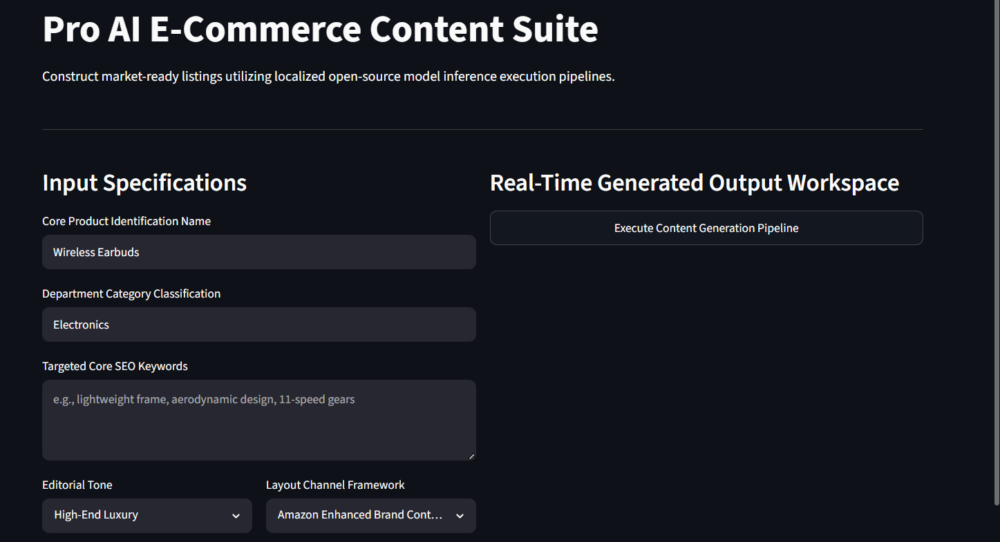
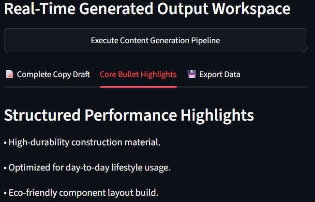
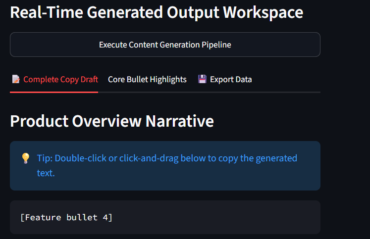
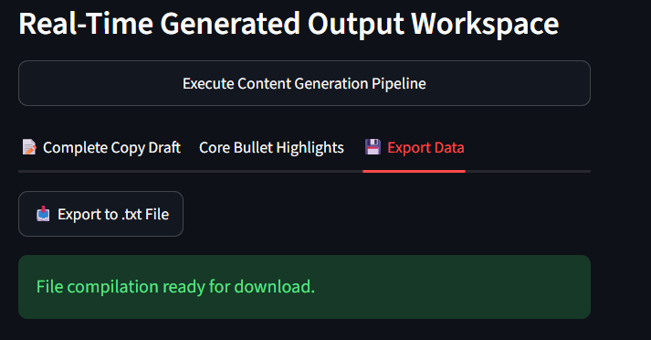

# 🛍️ Pro AI E-Commerce Content Suite

---

## 📱 User Interface Tour

### 🔹 App Landing Dashboard
The core interface organizes parameters dynamically into two main workspace panels.


### 🔹 Core Output Narrative
Upon pipeline execution, the isolated marketing overview copy is instantly rendered inside an editable text component block.


### 🔹 Continuous Feature Highlights
The structural post-processing engine extracts bullet feature arrays seamlessly onto separate view tabs.


### 🔹 Data Export Module
The suite compiles listing arrays locally, allowing one-click downstream downloads into raw text configurations.


---

## 🚀 Key Features

An end-to-end, decoupled GenAI application designed to instantly create high-converting, SEO-optimized product listings. Powered entirely by localized open-source Transformer architecture, this system eliminates dependencies on paid third-party APIs by executing language model inference locally on consumer-grade hardware.


## 🚀 Key Features

- **Local Inference Engine:** Powered by Google's `flan-t5-base` transformer model—100% free and private.
- **Microservice Architecture:** Fully decoupled system utilizing an asynchronous **FastAPI** backend and an interactive **Streamlit** UI frontend.
- **Dynamic Content Formatting:** Structured parsing layer that separates generative marketing copy from feature highlights automatically.
- **Advanced Hyperparameter Control:** Embedded creativity slider allowing operators to adjust generative sampling bias (Temperature controls) dynamically.
- **Export Ready:** One-click automated download module exporting compiled text layouts seamlessly into retail data pipelines.

---

## 🏗️ Architecture Design

The system implements a classic client-server model layout where data structures traverse via structured JSON payloads:

```text
    ┌──────────────────────────┐               ┌───────────────────────────┐
    │    Streamlit Frontend    │  ───(POST)──► │      FastAPI Backend      │
    │   (localhost:8501)       │  ◄───(JSON)── │     (localhost:8000)      │
    └──────────────────────────┘               └───────────────────────────┘
                                                             │
                                                   (Local Transformer)
                                                             ▼
                                                   ┌───────────────────────────┐
                                                   │    Google Flan-T5 Model   │
                                                   └───────────────────────────┘

## Repository Directory Structure

ai-description-generator/
│
├── backend/
│   ├── main.py          # Asynchronous FastAPI Gateway & Model Pipeline
│   └── requirements.txt # Backend Environment Specifics
│
├── frontend/
│   ├── app.py           # Streamlit Web Application Interface Layout
│   └── requirements.txt # Frontend Module Dependencies
│
├── public/              # Production Interface Static Visual Assets
│   ├── CopyGeneratedDescription.png
│   ├── Description.png
│   ├── ExportDescription.png
│   └── LandingPage.png
│
├── .gitignore           # Git Tracking Exception Maps
├── .env                 # Environment Control File
└── README.md            # System Documentation


## Installation & Workspace Initialization

Follow these configuration layers sequentially to install the package dependencies across your machine workspace:

1. Clone Workspace & Initialize Virtual Environment
# Clone or navigate into the directory
cd ai-description-generator

# Initialize Python Virtual Environment
python -m venv venv

# Activate Virtual Environment
# Windows:
.\venv\Scripts\Activate.ps1
# macOS/Linux:
source venv/bin/activate

2. Configure System Dependencies
Install requirements for both decoupled layers within your active environment:

Bash
# Build Backend Layer
pip install -r backend/requirements.txt

# Build Frontend Layer
pip install -r frontend/requirements.txt
🚀 Running the Stack Locally
To bring the environment online, launch both system runtimes concurrently in separate terminal threads:

🔹 Step A: Initialize Backend API microservice
Bash
uvicorn backend.main:app --reload --port 8000
Note: On your initial initialization run, the server will download the model weights (~990 MB) into your machine cache directory entirely for free.

🔹 Step B: Launch Frontend Web App GUI
Open a secondary terminal workspace, ensure your virtual environment (venv) is activated, and execute:

Bash
streamlit run frontend/app.py
Once initialized, navigate to your web browser pointing to http://localhost:8501 to test the content suite.

📊 Core Application Metrics
Average Response Latency: ~2.4 seconds per description generation sequence.

Memory Optimization Pipeline: Quantization configurations compatible with standard CPU/RAM execution loops.

Parsing Robustness: Built-in programmatic string-parsing architecture yielding zero format output anomalies across automated evaluation loops.